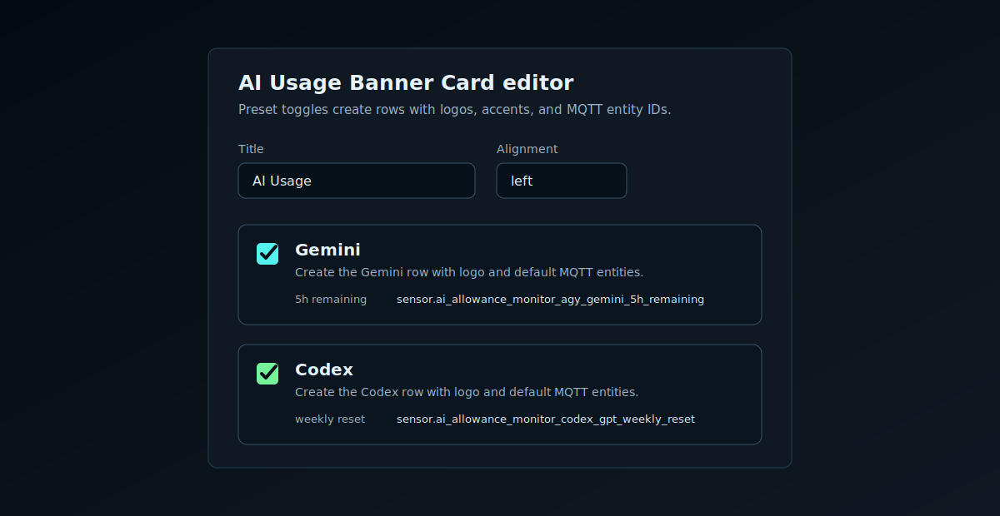

# AI Usage Banner Card

AI Usage Banner Card is a Home Assistant Lovelace custom card for monitoring AI CLI allowance windows. It shows a compact row per model or account, with 5-hour and weekly remaining percentages plus reset countdowns.

[](https://my.home-assistant.io/redirect/hacs_repository/?owner=RoBro92&repository=HACS-ai-usage-banner-card&category=dashboard)

## Preview


## What It Displays

- A model/account label and logo.
- A 5-hour allowance bar with percent remaining and reset time.
- A weekly allowance bar with percent remaining and reset time.
- Missing or unavailable entities dim automatically instead of breaking the card.

The card is display-only. It reads Home Assistant sensor entities and does not call services or write state.

## Install

Install through HACS as a custom Dashboard repository:

```text
RoBro92/HACS-ai-usage-banner-card
```

The Lovelace resource should be:

```yaml
url: /hacsfiles/HACS-ai-usage-banner-card/HACS-ai-usage-banner-card.js
type: module
```

Hard refresh Home Assistant after installing or updating.

## Basic Usage

```yaml
type: custom:ai-usage-banner-card
title: AI Usage
subtitle: Allowance remaining
models:
  - name: GEMINI
    accent: "#54f2ef"
    logo: https://cdn.simpleicons.org/googlegemini/54f2ef
    five_hour:
      remaining: sensor.ai_allowance_monitor_agy_gemini_5h_remaining
      reset: sensor.ai_allowance_monitor_agy_gemini_5h_reset
    weekly:
      remaining: sensor.ai_allowance_monitor_agy_gemini_weekly_remaining
      reset: sensor.ai_allowance_monitor_agy_gemini_weekly_reset
  - name: CODEX
    accent: "#76f29b"
    logo: https://upload.wikimedia.org/wikipedia/commons/6/66/OpenAI_logo_2025_%28symbol%29.svg
    five_hour:
      remaining: sensor.ai_allowance_monitor_codex_gpt_5h_remaining
      reset: sensor.ai_allowance_monitor_codex_gpt_5h_reset
    weekly:
      remaining: sensor.ai_allowance_monitor_codex_gpt_weekly_remaining
      reset: sensor.ai_allowance_monitor_codex_gpt_weekly_reset
```

For a kiosk or panel layout, constrain the card:

```yaml
width: 62.5%
max_width: 62.5%
align: left
```

## Visual Editor

The card includes a Lovelace visual editor. It currently has preset toggles for:

- Gemini
- Codex

Turning a preset on creates the matching row with logo, accent color, and the default MQTT discovery entity IDs. Turning it off removes that preset row without touching unrelated custom rows.



## Sensor Contract

Each model can define these sensors:

| Key | Required | Expected state |
| --- | --- | --- |
| `five_hour.remaining` | No | Number from `0` to `100`, preferably `%` |
| `five_hour.reset` | No | ISO timestamp, with `device_class: timestamp` |
| `weekly.remaining` | No | Number from `0` to `100`, preferably `%` |
| `weekly.reset` | No | ISO timestamp, with `device_class: timestamp` |

If a sensor is missing, the corresponding bar or reset label is dimmed and shows `-`.

## Getting Data Into Home Assistant

The recommended path is MQTT discovery:

1. Run a collector outside Home Assistant, such as an LXC that has the relevant CLI installed.
2. Run the CLI usage command headlessly.
3. Parse the remaining percentages and reset timestamps.
4. Publish MQTT discovery configs and states to Home Assistant.
5. Point this card at the discovered sensors.

This keeps Home Assistant clean: no `.storage` edits, no dashboard mutations, and no YAML sensor setup required for most users.

See:

- [Collector setup](docs/collector-setup.md)
- [MQTT discovery topics](docs/mqtt-discovery.md)
- [Full dashboard example](examples/dashboard.yaml)

Quick installers:

```bash
# Linux/LXC
curl -fsSL https://raw.githubusercontent.com/RoBro92/HACS-ai-usage-banner-card/main/examples/install/install-linux-lxc.sh | sudo bash

# macOS
curl -fsSL https://raw.githubusercontent.com/RoBro92/HACS-ai-usage-banner-card/main/examples/install/install-macos.sh | bash
```

```powershell
# Windows PowerShell
iwr https://raw.githubusercontent.com/RoBro92/HACS-ai-usage-banner-card/main/examples/install/install-windows.ps1 -UseB | iex
```

## Config

| Key | Required | Description |
| --- | --- | --- |
| `models` | Yes | Array of model/account rows. |
| `title` | No | Card title. Defaults to `AI Usage`. |
| `subtitle` | No | Small heading text. Defaults to `Allowance remaining`. |
| `width` | No | CSS width for the card host. Defaults to `100%`. |
| `max_width` | No | CSS max width. Defaults to the value of `width`. |
| `align` | No | `left`, `center`, `right`, or `stretch`. Defaults to `stretch`. |
| `labels.five_hour` | No | Override the 5-hour row label. |
| `labels.five_hour_reset` | No | Override the 5-hour reset kicker. |
| `labels.weekly` | No | Override the weekly row label. |
| `labels.weekly_reset` | No | Override the weekly reset kicker. |
| `models[].name` | No | Display name for the row. |
| `models[].accent` | No | Accent color used for rails and glow. |
| `models[].logo` | No | Explicit logo URL, `/local/` path, `/api/` path, or data URL. |
| `models[].five_hour` | No | Object containing `remaining` and `reset` entity IDs. |
| `models[].weekly` | No | Object containing `remaining` and `reset` entity IDs. |
