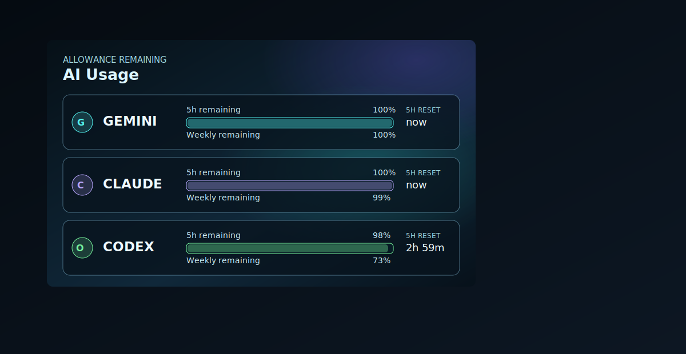

# AI Usage Banner Card

Compact Lovelace card for AI CLI allowance monitoring.



## Public Testing

Install as a HACS custom Dashboard repository:

```text
RoBro92/HACS-ai-usage-banner-card
```

Use MQTT discovery sensors or any sensors with numeric percentage states and timestamp reset states.

## Visual Editor

The visual editor includes Gemini and Codex preset toggles. Enabling a toggle creates the relevant row, logo, accent color, and default MQTT entity mapping.
